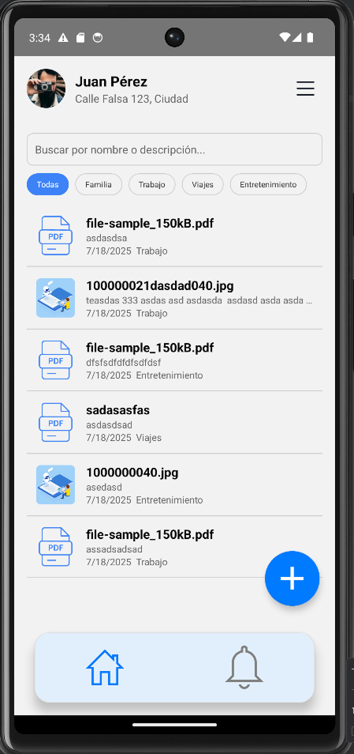
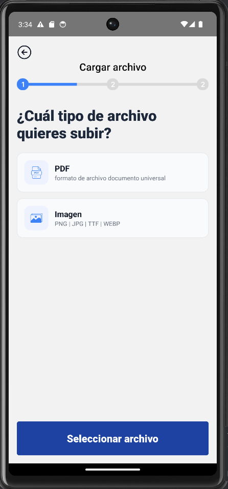
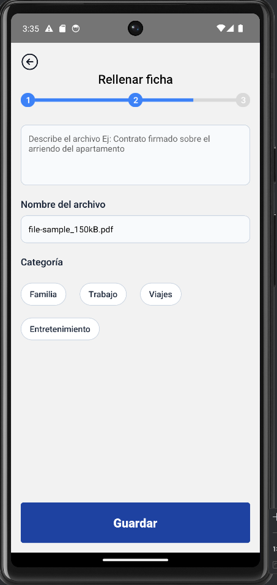
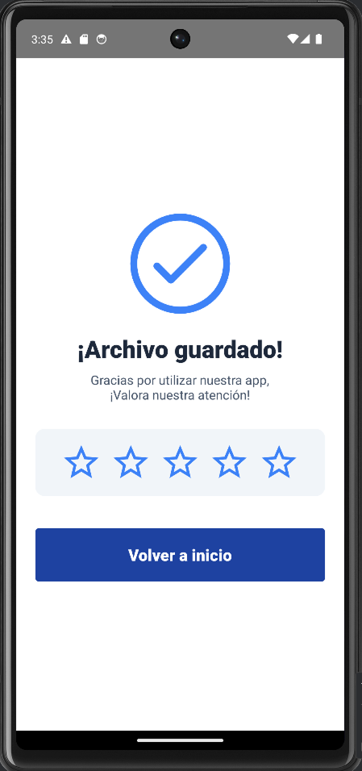
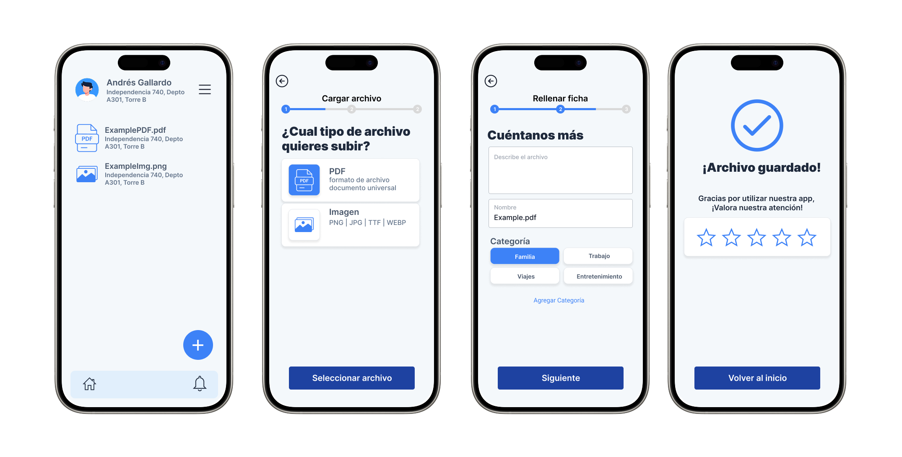
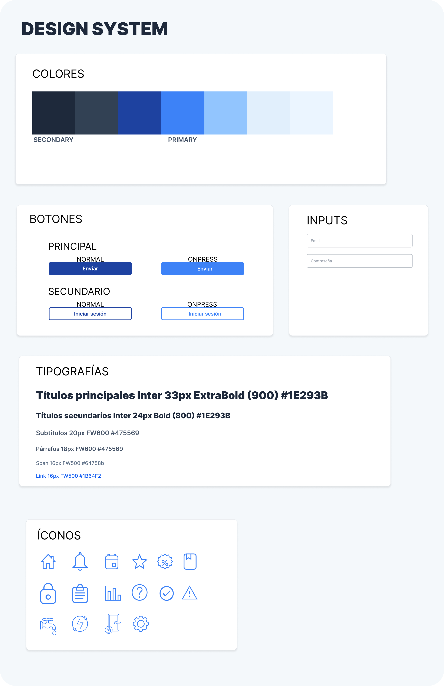

# Mobile Document Manager

**Mobile Document Manager** es una aplicación móvil construida con **React Native**, orientada a gestionar documentos locales en dispositivos móviles. Permite al usuario seleccionar, describir, visualizar, filtrar, editar y eliminar documentos PDF o imágenes, categorizándolos y manteniéndolos almacenados localmente mediante AsyncStorage.

---

## Pasos para instalación local

### 1. Clona el proyecto

git clone https://github.com/...
cd mobile-document-manager

### 2. Instala las dependencias

npm install

### 3. Corre en Android o IOS

#Android
npx react-native run-android

#IOS
cd ios && pod install && cd ..
npx react-native run-ios


# Tecnologías

React Native
TypeScript
React Navigation
react-native-pdf
AsyncStorage
ImagePicker

---

## Estructura del Proyecto

La arquitectura de esta aplicación está basada en dos principios clave: **Feature-Based Design** y **Atomic Design**.

---

### ¿Por qué Feature-Based Design?

Feature-Based Design organiza el código por funcionalidad, no por tipo de archivo. Esto permite:

- Agrupar pantallas, componentes y lógica relacionada dentro de una misma carpeta (`features`).
- Escalar más fácilmente la aplicación sin que se convierta en una estructura plana y desorganizada.
- Facilitar la colaboración entre equipos, ya que cada feature está desacoplada de las demás.
- Promueve encapsulamiento: todo lo que pertenece a una funcionalidad vive en su propia carpeta.


Esto hace que agregar una nueva funcionalidad (ej. favoritos, compartir, búsqueda) implique simplemente crear una nueva carpeta dentro de `features`, manteniendo todo lo relacionado en un solo lugar.

---

### ¿Por qué Atomic Design?

El patrón de diseño atómico organiza los componentes UI en niveles de complejidad:

- **Atoms:** elementos básicos de UI (Botón, Ícono, Input).
- **Molecules/Organisms (opcional):** agrupaciones reutilizables de UI.
- **Templates/Pages (en pantallas, no explícitamente nombrado aquí).**

Esta organización:

- Favorece la reutilización y consistencia visual.
- Reduce la duplicación de código.
- Hace que los cambios de diseño sean más fáciles de aplicar globalmente.

---

## Funcionalidades Principales de la App

- ✅ Cargar documentos (PDFs e imágenes).
- ✅ Añadir nombre, descripción y categoría al documento.
- ✅ Previsualización (PDF con `react-native-pdf`, imágenes con `Image`).
- ✅ Edición y eliminación de archivos.
- ✅ Búsqueda por nombre o descripción y filtro por categoría
- ✅ Calificación del servicio tras guardar el documento.
- ✅ Persistencia de datos con AsyncStorage.

---

## Almacenamiento con AsyncStorage

Los documentos se guardan localmente en el dispositivo usando `@react-native-async-storage/async-storage` bajo la clave:

```ts
const STORAGE_KEY = '@documents';

Los documentos se almacenan en AsyncStorage bajo la key @documents:

{
  id: string;             // Identificador único
  name: string;           // Nombre del archivo (editable)
  description: string;    // Descripción del archivo
  category: string;       // Categoría asignada
  uri: string;            // URI del archivo original
  localUri: string;       // Copia local para uso en la app
  type: string;           // Tipo MIME (e.g., image/jpeg, application/pdf)
  date: string;           // Fecha de carga
}
```

---

## Capturas de pantalla






## Diseño UI/UX



